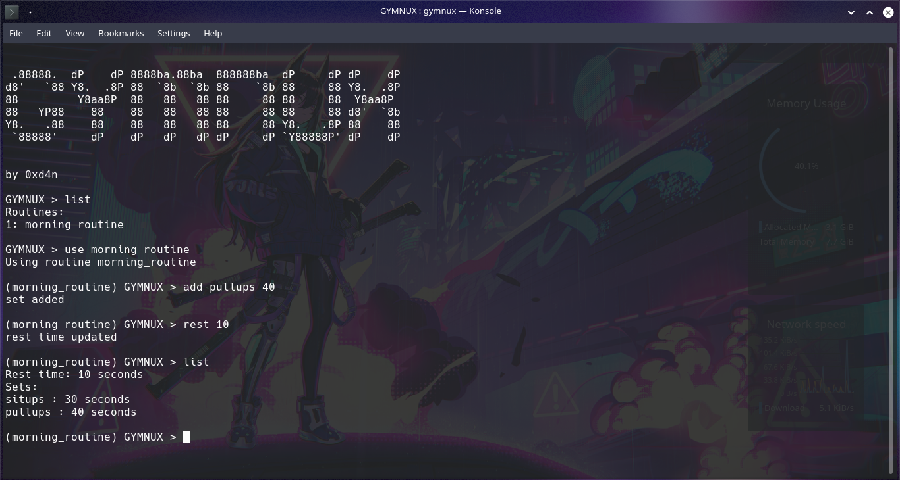

# Gymnux - Workout Timer for Linux

## Table of Contents

- [Introduction](#introduction)
- [Features](#features)
- [Dependencies](#dependencies)
- [Installation](#installation)
- [Usage](#usage)
- [Contributing](#contributing)
- [To-Do](#To-Do)
- [License](#license)

## Introduction

Gymnux is a simple command-line utility for Linux that allows users to create and execute workout routines. It provides a terminal interface, making it easy to use without the need for a graphical user interface.

## Features

- Create and run custom workout routines with set time intervals.
- Minimalistic terminal interface for ease of use.
- Cross-platform compatibility on Linux.

## Dependencies

Before compiling and using Gymnux, make sure you have the following dependencies installed on your Linux system:

- `gcc`
- `libsdl2-dev`
- `libjson-c-dev`

You can install these libraries using the package manager specific to your Linux distribution.

**For Debian/Ubuntu-based systems:**

```bash
sudo apt-get update
sudo apt-get install libsdl2-dev libjson-c-dev gcc
```

**For Fedora-based systems:**
```
sudo dnf install SDL2-devel json-c-devel gcc
```
For other Linux distributions, please refer to their respective package management systems.
## Installation

To compile Gymnux, ensure you have GCC (GNU Compiler Collection) installed on your system. Then, follow these steps:

Clone this GitHub repository:


```
git clone https://github.com/0xd4n10/gymnux.git
cd gymnux
```
Use the provided make file to compile the code:


```
make
````
The executable gymnux will be created in the bin directory.


## Usage

To run Gymnux, use the following command:

```
cd bin
./gymnux
```
use the help command to guide you through the process of creating and running your workout routine. You can set the interval time between exercises and choose from pre-defined routines to get started quickly.

Note: Gymnux currently supports simple routines but may expand its capabilities in future updates.
## Contributing

We welcome contributions to improve Gymnux and make it more useful for the fitness community. If you have any bug fixes, new features, or enhancements in mind, feel free to open an issue or submit a pull request. Please ensure that your code adheres to the project's coding standards.

## To-Do 

- [ ] Add support for termux (Incomplete)
- [ ] Add functionality for deleting sets from routines (Incomplete)
- [ ] Add support for Windows & MacOS (Incomplete)
- [ ] Add functionality for intervals within sets (Incomplete)
      
## License

This project is licensed under the MIT License. Feel free to use, modify, and distribute the code for your purposes. However, we would appreciate it if you give credit to the original authors by linking back to this repository.
